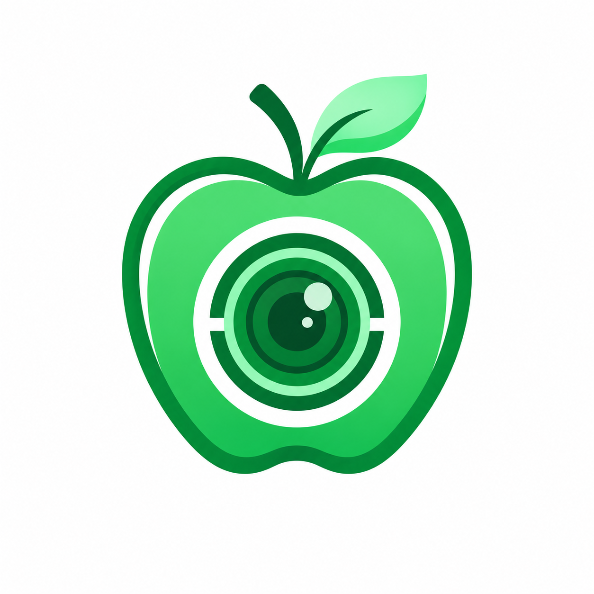
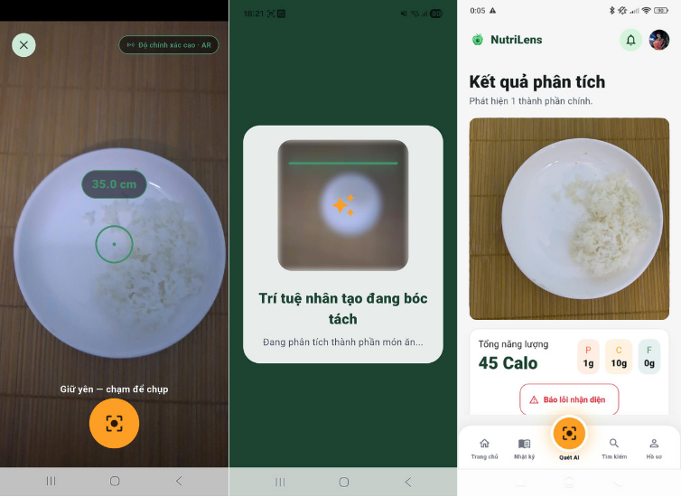
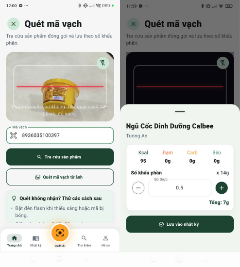
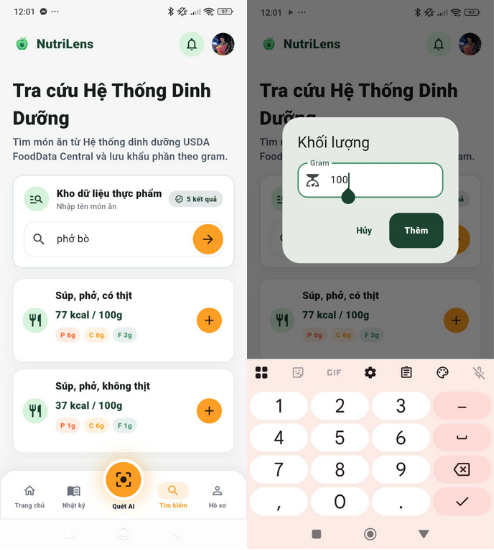

<p align="center">
  
</p>

<h1 align="center">NutriLens Mobile App</h1>

<p align="center">
  Mobile application for the graduation project <strong>"Building a 2D Food Image-Based Calorie Estimation System"</strong>
</p>

<p align="center">
  
  
  
  
</p>

## Interface Screenshots

<p align="center">
  
  
  
</p>


## Overview

NutriLens Mobile App is the main end-user client in the NutriLens ecosystem. It allows users to capture 2D food images, submit them to the backend, track AI processing progress, and view estimated calories, protein, carbohydrates, fat, and ingredient-level nutrition details.

The project aims to reduce the burden of manual food diary logging and minimize subjective errors from portion-size estimation. The AI pipeline combines food detection, ingredient reasoning, instance segmentation, monocular depth estimation, and geometric volume calculation. Experiments on Nutrition5K achieved **69.23 kCal MAE** and **27.36% MAPE**, with an average integrated system response time under 5 seconds.

## Key Features

- User registration, login, OTP verification, and JWT-based session management.
- Capture or select 2D food images for nutrition analysis.
- Submit camera metadata, optional depth information, and idempotency keys for reliable backend processing.
- Track AI inference status in near real time.
- Display analysis results including calories, macronutrients, and ingredient-level components.
- Look up and log packaged foods by barcode.
- Search foods from USDA data, create manual meals, and adjust serving sizes.
- Manage daily meal diaries, view meal details, and inspect nutrition trends.

## System Architecture

```text
Flutter Mobile App
        |
        | REST API / Multipart Upload
        v
Django Backend  ---- Celery/Redis ---- FastAPI AI Server
        |
        v
PostgreSQL + Cloudinary + Open Food Facts + USDA
```

## Tech Stack

- Flutter SDK `>=3.4.0 <4.0.0`
- Dart
- `flutter_bloc` for state management
- `go_router` for navigation
- `dio` for HTTP networking
- `flutter_secure_storage` for secure token storage
- `camera`, `image_picker`, and `mobile_scanner` for image capture and barcode scanning
- `fl_chart` for nutrition charts

## Project Structure

```text
lib/
  core/        API config, router, network client, theme, storage
  features/    Auth, scan, meal, diary, search, profile, reports
  shared/      Reusable widgets
assets/
  brand/       Logo and brand assets
docs/assets/   Screenshots, logo, and demo images used by this README
```

## Local Setup

```bash
flutter pub get
cp .env.example .env
flutter run
```

For Android Emulator, if the backend is running on the host machine, configure:

```env
NUTRILENS_API_BASE_URL=http://10.0.2.2:8000
```

For a physical device, use a LAN IP address or a backend domain reachable from the device.

## Main Environment Variables

```env
NUTRILENS_API_BASE_URL=http://localhost:8000
NUTRILENS_INFERENCE_CREATE_PATH=/api/v1/inference/image/
NUTRILENS_MEAL_BARCODE_PATH=/api/v1/analysis/meals/barcode/
NUTRILENS_BARCODE_LOOKUP_PATH=/api/v1/analysis/barcodes/{barcode}/
NUTRILENS_REPORTS_NUTRITION_SUMMARY_PATH=/api/v1/reports/nutrition/summary/
```

## Quality Checks

```bash
flutter analyze
flutter test
```

## Related Repositories

- AI Server: https://github.com/IloveUhiuhiu/nutrilens-ai-server
- Backend Server: https://github.com/IloveUhiuhiu/nutrilens-backend
- Web Admin Interface: https://github.com/IloveUhiuhiu/nutrilens-web-frontend
- Mobile Application: https://github.com/IloveUhiuhiu/nutrilens-mobile-app

## Contributors

This graduation project was developed by **Dang Phuc Long** and the NutriLens project team.
